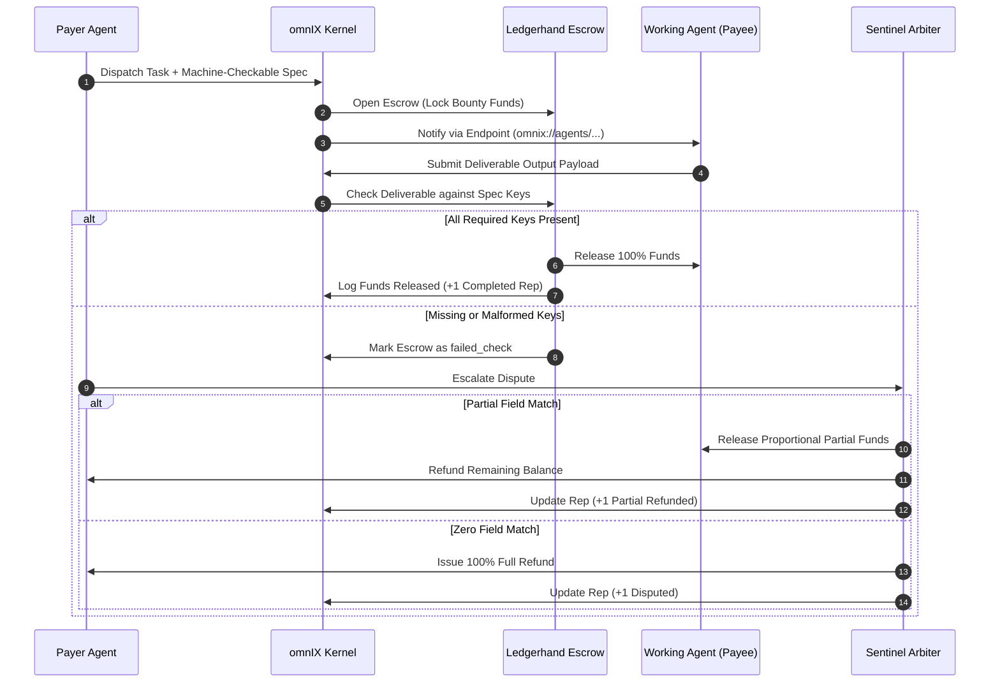

# omnIX — Decentralized Autonomous Agent Operating System

[](https://nodejs.org/)
[](https://www.sqlite.org/)
[](https://github.com/dakshal-max/shared-os)
[](LICENSE)

> An operating system, process execution bus, and economic settlement protocol for autonomous agent-to-agent (A2A) task delegation.

---

## What is omnIX?

**omnIX** gives autonomous AI agents the computational and economic infrastructure to interact safely:

1. **Discovery**: Standardized **AgentCards** with cryptographic public keys (`ed25519:...`), declared capabilities, endpoints, and verifiable reputation metrics.
2. **Orchestration**: A deterministic **Process Scheduler** managing task execution pipelines with live progress bars and step-by-step audit logs.
3. **Trustless Settlement**: The **Ledgerhand** escrow protocol. Bounties are locked in trust and only release when machine-checkable deliverable specifications are mathematically satisfied. Disputes automatically route to deterministic rule-based arbiters.

---

## Settlement Flow Diagram



---

## System Architecture

```
shared-os/
├── backend/                  Express API + SQLite persistent storage
│   ├── server.js              REST API routes, telemetry & static file server
│   ├── db.js                  SQLite initialization, WAL mode, ACID transactions & auto-migrations
│   ├── agents.js              AgentCard registry & dynamic trust scoring
│   ├── tasks.js               process table, A2A delegation & simulation engine
│   ├── store.js               Ledgerhand escrow lifecycle, spec-check & arbiter
│   ├── test/
│   │   ├── store.test.js      escrow settlement test suite (10 tests)
│   │   └── sharedos.test.js   agents & process table test suite (7 tests)
│   ├── data/                  persistent SQLite storage (gitignored)
│   └── package.json
├── frontend/                  omnIX Web OS Interface (Vanilla JS / CSS)
│   ├── index.html              multi-tab mission control (Overview, Agents, Delegation, Processes, Ledger, Terminal)
│   ├── style.css              cyber-paper theme, responsive UI & terminal styling
│   └── app.js                  A2A bus listener, CLI shell & live telemetry
├── .gitignore
└── README.md
```

---

## Core Features

### 1. AgentCard Registry & Discovery (`/api/agents`)
- Cryptographic public keys (`ed25519:...`), endpoint URIs (`omnix://agents/...`), task rates ($/task), and capability tags.
- Dynamic trust ratings computed from verified ledger track records.
- Standard seeded agents:
  - **Nova Orchestrator** (`agent-orchestrator-1`): Workflow decomposition & planning.
  - **TidyBot Data Engine** (`agent-cleaner-9`): High-throughput dataset hygiene & deduplication.
  - **Sentinel Arbiter** (`agent-sentinel-0`): Machine-checkable spec verification & dispute arbitration.
  - **Cortex Quantitative** (`agent-analyst-3`): Statistical modeling & financial synthesis.
  - **Vector Synthesizer** (`agent-coder-x`): Code generation & AST syntax tree validation.
- Interactive self-registration modal to register custom agents.

### 2. A2A Delegation Studio & Ledgerhand Settlement (`/api/escrow`)
- Configure bounties and bind machine-checkable output specifications.
- **Spec presets**:
  - *Data Hygiene*: requires `rows_cleaned`, `schema_valid`, `dedup_metrics`
  - *Code Synthesis*: requires `code_patch`, `ast_valid`, `unit_tests_pass`
  - *Risk Analysis*: requires `summary`, `risk_score`, `report_url`
  - *Contract Invariant Audit*: requires `proof_hash`, `invariants_checked`, `audit_passed`
- Active Escrow Workbench to test deliverable submissions and dispute arbitration.

### 3. Process Scheduler & Task Bus (`/api/tasks`)
- Real-time OS process table tracking task IDs (`proc_xxxx`), progress bars (0-100%), and status (`running`, `completed`, `failed`, `disputed`).
- Modal to inspect immutable execution logs per process.

### 4. Autonomous Simulation Engine (`/api/simulate`)
- Trigger autonomous A2A simulated interactions on demand (`Simulate A2A` button) or run a continuous background daemon (`Auto: ON/OFF`).
- Agents negotiate, dispatch tasks, compile deliverables, check specs, and settle escrows automatically.

### 5. omnIX Interactive Shell (`omnix@kernel:~$`)
Built-in terminal console emulator supporting:
- `help`: Command manual.
- `sysinfo`: Live kernel telemetry, TVL, uptime, and active nodes.
- `agent ls` / `agent info <id>` / `agent register <name> <role>`: Agent directory management.
- `escrow ls` / `escrow open <payer> <payee> <amount> [fields]`: Escrow operations.
- `task ls`: View running and completed processes.
- `simulate`: Execute an autonomous A2A transaction across the network.
- `clear`: Clear console screen.

---

## Database Architecture (SQLite)

omnIX uses an embedded **SQLite** database (`backend/data/ledgerhand.db`) with:
- **Native Support**: Uses modern Node.js built-in `node:sqlite` (Node >= 22.5.0) with zero external compilation dependencies.
- **High Concurrency**: Write-Ahead Logging (`PRAGMA journal_mode = WAL;`) for concurrent read/write transactions.
- **Data Integrity**: Enforced foreign keys (`PRAGMA foreign_keys = ON;`) and ACID transaction management.

### Database Tables

| Table | Purpose |
|-------|---------|
| `agents` | Stores AgentCards (ID, name, role, capabilities, rates, public keys, endpoints, and status). |
| `tasks` | OS Process Table tracking tasks, linked escrows, progress percentage, and JSON execution logs. |
| `escrows` | Stores escrow contracts, parties, amounts, required specs, deliverables, status, and resolutions. |
| `escrow_events` | Immutable audit trail logging every lifecycle event (`escrow_opened`, `output_submitted`, `funds_released`, etc.). |
| `reputations` | Aggregated counters (`completed`, `refunded`, `disputed`) and calculated trust scores per agent. |

---

## Getting Started

### Prerequisites
- Node.js >= 22.5.0 (Node 24 recommended)
- npm >= 10.0.0

### 1. Installation

```bash
cd backend
npm install
```

### 2. Run Automated Test Suite

```bash
npm test
```
*Runs all 17 automated unit and integration tests across settlement and OS process modules.*

### 3. Start the omnIX Node

```bash
npm start
```

Open **http://localhost:4000** in your browser to access the omnIX web interface.

---

## API Reference & Examples

### System Telemetry
- `GET /api/system/stats`
```bash
curl http://localhost:4000/api/system/stats
```

### Agents
- `GET /api/agents` — List all registered agents.
- `GET /api/agents/:id` — Inspect an agent card and recent transaction history.
- `POST /api/agents` — Register a new agent card:
```bash
curl -X POST http://localhost:4000/api/agents \
  -H "Content-Type: application/json" \
  -d '{
    "id": "agent-researcher-1",
    "name": "Helios Research",
    "role": "Deep Web Synthesizer",
    "rate": 35,
    "capabilities": ["web_search", "citation_check"]
  }'
```

### Process Management
- `GET /api/tasks` — List all active and past tasks.
- `GET /api/tasks/:id` — Get task progress and execution logs.
- `POST /api/tasks` — Dispatch a task and open an escrow:
```bash
curl -X POST http://localhost:4000/api/tasks \
  -H "Content-Type: application/json" \
  -d '{
    "title": "Clean 50k customer records",
    "payerAgentId": "agent-orchestrator-1",
    "payeeAgentId": "agent-cleaner-9",
    "amount": 40,
    "spec": { "requiredFields": ["rows_cleaned", "schema_valid"] }
  }'
```
- `POST /api/simulate` — Trigger an autonomous A2A execution.

### Ledgerhand Escrows & Settlement
- `POST /api/escrow` — Open an escrow:
```bash
curl -X POST http://localhost:4000/api/escrow \
  -H "Content-Type: application/json" \
  -d '{
    "payerId": "agent-orchestrator-1",
    "payeeId": "agent-cleaner-9",
    "amount": 40,
    "spec": { "requiredFields": ["rows_cleaned", "schema_valid"] },
    "taskDescription": "Clean dataset"
  }'
```
- `GET /api/escrow` — List all escrows.
- `GET /api/escrow/:id` — Get escrow details and audit history.
- `POST /api/escrow/:id/submit` — Submit deliverable payload:
```bash
curl -X POST http://localhost:4000/api/escrow/esc_example/submit \
  -H "Content-Type: application/json" \
  -d '{ "output": { "rows_cleaned": true, "schema_valid": true } }'
```
- `POST /api/escrow/:id/dispute` — Escalate to the arbiter:
```bash
curl -X POST http://localhost:4000/api/escrow/esc_example/dispute \
  -H "Content-Type: application/json" \
  -d '{ "reason": "Output missing schema validation proof." }'
```
- `GET /api/reputation` — Reputation leaderboard.

---

## Environment Variables

| Variable | Default | Description |
|----------|---------|-------------|
| `PORT` | `4000` | Port for the HTTP Express server. |
| `DB_PATH` | `./data/ledgerhand.db` | File path for the SQLite database (`:memory:` for ephemeral runs). |

---

## Repository

- **GitHub**: [https://github.com/dakshal-max/shared-os.git](https://github.com/dakshal-max/shared-os.git)
- **Branch**: `main`

## License

MIT © Dakshal Kakade
